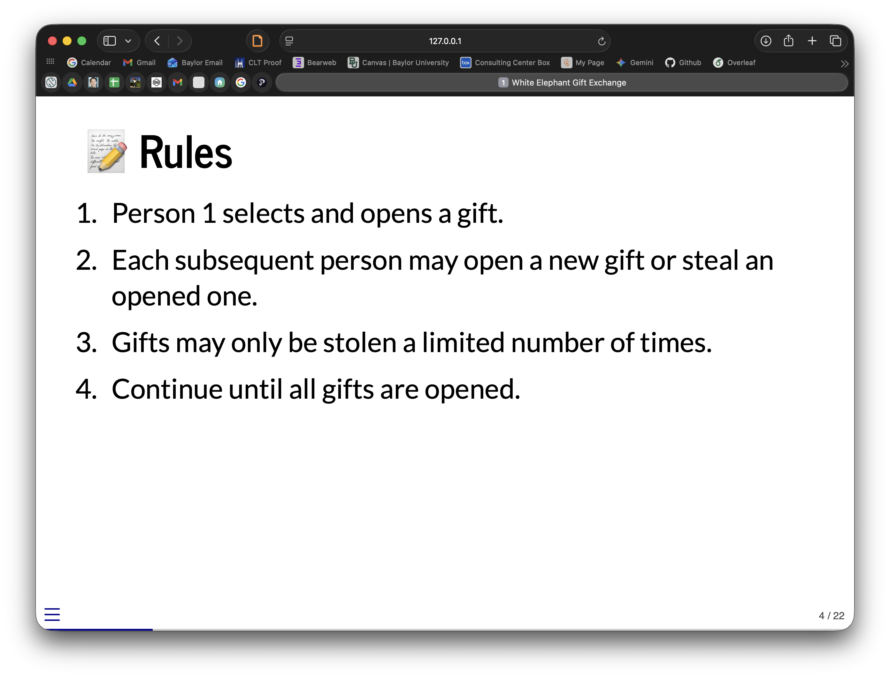

# giftR

> A Holiday Gift Exchange Facilitator

`giftR` provides tools to facilitate holiday gift exchanges, including a White Elephant game facilitator and a Secret Santa organizer.

---

## Installation

Make sure you have the required packages:

```r
install.packages(c("quarto", "glue", "blastula"))
pak::pak("carsonslater/giftR")
library("giftR")
```

---

## White Elephant Exchange

The `white_elephant()` function generates a **reveal.js presentation** to run a White Elephant gift exchange. It’s perfect for holiday parties, office events, or any gathering where you want to randomly reveal participants’ turns in a fun, interactive way.

### Features

- Automatically creates a **title slide** and **rules slide**.
- Randomizes the **order of participants**.
- Generates **one slide per participant** with a “It’s your turn!” prompt.
- Includes a **footer link to the rules** on every slide.
- Renders a **reveal.js presentation** viewable in your RStudio Viewer or web browser.

### Usage

```r
names <- c("John", "Aidan", "Clara", "Jimmy", "Theo",
           "Meredith", "Caleb", "Samantha", "Sharon")

# Generate the White Elephant reveal.js presentation
white_elephant(names)
```

Running this function will open a **fully interactive slide deck** in your viewer or default browser. Participants can follow the slides to take turns opening or stealing gifts, and the rules are always accessible via the footer link. The presentation should have a rules slide that looks like this:




---

## Secret Santa Exchange

The `secret_santa()` function assigns a Secret Santa to each participant and sends them an email with their assignment using the `blastula` package. It ensures that no one is assigned themselves.

### Usage

To use this function, you need to provide a list of names and emails. You also need to have your email credentials set up.

**Important**: The function expects your email password to be stored in an environment variable (default: `SMTP_PASSWORD`).

```r
# 1. Set your email password (or add to .Renviron)
Sys.setenv(SMTP_PASSWORD = "your_app_password")

# 2. Define participants
names <- c("Alice", "Bob", "Charlie")
emails <- c("alice@example.com", "bob@example.com", "charlie@example.com")

# 3. Run the exchange
secret_santa(
  names = names,
  emails = emails,
  sender_email = "organizer@example.com",
  smtp_provider = "gmail", # or "outlook", "office365", etc.
  subject = "Your Secret Santa Assignment 🎅"
)
```
